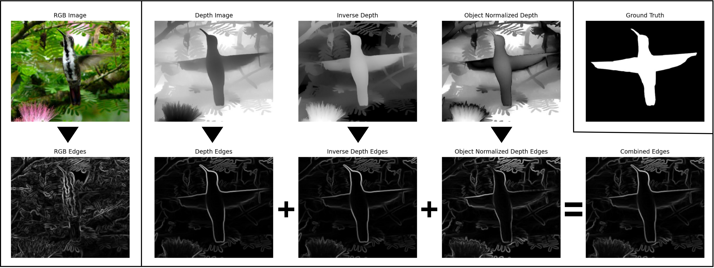

# BED-SAM2: Boundary-Enhanced-Depth SAM2 via Monocular Geometric Priors

This repository accompanies the paper:

**BED-SAM2: Boundary-Enhanced-Depth SAM2 via Monocular Geometric Priors**  
Tyler Rust, Dara McNally, Kyle O’Donnell, Colin Kelly, Chandra Kambhamettu  
CVPR Workshop: Computer Vision in the Wild (CVinW) 2026

---

## Abstract

Building upon the SAM2 vision foundation model for downstream segmentation, this study introduces Boundary Enhanced Depth (BED)-SAM2. The SAM2 Hiera encoder architecture is modified to directly encode monocular depth information from RGB images, thereby providing geometric cues that enhance object boundary delineation and facilitate the extraction of camouflaged object shapes. BED-SAM2 demonstrates competitive state-of-the-art performance across multiple salient and camouflaged object detection tasks with as few as five training epochs. 

---

## Overview

**Key contributions:**
- Early-fusion integration of monocular depth edges into the SAM2 Hiera encoder
- Improved boundary quality and convergence speed in SOD and COD tasks
- State-of-the-art performance on multiple benchmarks, including high-resolution datasets

**Core idea:**  
Monocular depth provides complementary geometric structure that is largely invariant to texture and color. Encoding depth *edges* directly at the input level allows SAM2 to learn sharper object boundaries without requiring true depth sensors or additional backbones.

---

## Architecture

SAM2-DUNet is adapted from SAM2-UNet and consists of:

- **Encoder:**  
  - SAM2 Hiera backbone  
  - Input extended from RGB (3 channels) to RGB + depth edges (4 channels)  
  - LoRA injected into all transformer layers for efficient fine-tuning

- **Depth Edge Construction:**  
  - Monocular depth prediction (Distill Any Depth)
  - Edge extraction using Sobel filters on:
    - Raw depth
    - Inverse depth
    - Centered (mid-range emphasized) depth
  - Element-wise summation of all edge maps

- **Decoder:**  
  - U-Net–style decoder
  - Receptive Field Blocks (RFBs) with increased channel capacity (256)
  - Multi-scale supervision

---

## Depth Edge Formulation

Given normalized depth \( D \in [0, 1] \), a centered depth representation is defined as:

\[
D'(x, y) = |D(x, y) - 0.5| \cdot 2
\]

Sobel filters are applied independently to:
- \( D \)
- \( 1 - D \)
- \( D' \)

The resulting soft edge maps are summed to produce a single structural input channel.

---

## Tasks and Benchmarks

BED-SAM2 is evaluated on three task categories:

### RGB Salient Object Detection
- DUTS
- DUT-OMRON
- ECSSD
- HKU-IS
- PASCAL-S

### RGB-D Salient Object Detection
- NJU2K
- NLPR
- SIP
- STERE

### Camouflaged Object Detection
- CAMO
- COD10K
- CHAMELEON
- NC4K

---

## Results Summary

- Achieves state-of-the-art performance on SOD and COD tasks
- Demonstrates strong improvements in boundary quality and convergence speed
- Monocular depth edges outperform or match ground-truth depth in several RGB-D datasets
- Performance gains are most pronounced at object boundaries and in high-resolution settings

See the paper for full quantitative comparisons and ablation studies.

---

## Implementation Details

- **Backbone:** SAM2.1 Hiera-L
- **Depth Estimation:** Distill Any Depth
- **Optimizer:** AdamW
- **Loss:** Weighted BCE + Weighted IoU (structure loss)
- **Training Hardware:** Single RTX 5090 (32GB VRAM)
- **Input Resolutions:** 352×352, 512×512, 1024×1024

---

## Citation

If you find this work useful, please cite:

Pending...
